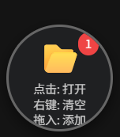
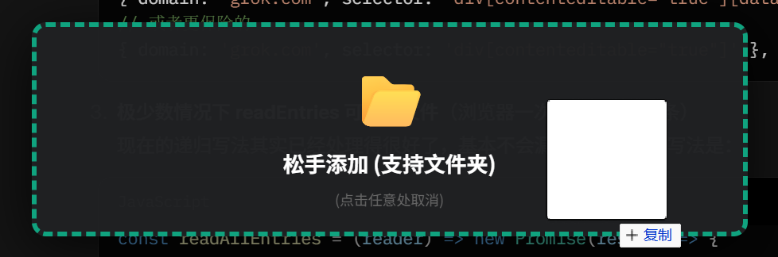

---

# 🤖 AI File Merger & Injector  
> ⚡ 一款支持**文件夹拖拽递归读取** + **代码合并注入**的油猴脚本，专为 AI 聊天平台（ChatGPT / Claude / Gemini / Qwen / DeepSeek / Grok）打造。

[](https://www.tampermonkey.net/)
[](https://opensource.org/licenses/MIT)


> ✅ 支持拖拽**整个文件夹**（含子目录）  
> ✅ 自动提取文件路径 + 扩展名 → 标记为 Markdown 代码块  
> ✅ 可编辑/删除/清空/复制/一键填入当前 AI 输入框  
> ✅ 跨主流大模型平台统一适配

---

## 📸 效果预览

| 悬浮球（常态）              | 拖拽时展开                    | 弹窗编辑界面                                                                                    |
| --------------------------- | ----------------------------- | ----------------------------------------------------------------------------------------------- |
|  |  |  |

> 💡 实际效果请见：**安装后访问 [chatgpt.com](https://chatgpt.com) 拖入一个文件夹试试！**

---

## ✅ 支持的平台

| 平台                    | 匹配 URL                      |
| ----------------------- | ----------------------------- |
| **ChatGPT**             | `https://chatgpt.com/*`       |
| **Qwen (通义千问)**     | `https://chat.qwen.ai/*`      |
| **Gemini**              | `https://gemini.google.com/*` |
| **DeepSeek (深度求索)** | `https://chat.deepseek.com/*` |
| **Claude**              | `https://claude.ai/*`         |
| **Grok**                | `https://grok.com/*`          |

> ✅ 自动识别输入框位置，一键填入内容。

---

## 🛠️ 安装方式

### 方法 1：直接安装（推荐）

点击下方链接（需已安装 [Tampermonkey](https://www.tampermonkey.net/) 或 Violentmonkey）：
🔗 [👉 安装最新版 `file_merger.user.js`](https://raw.githubusercontent.com/make-a/file_merger/main/file_merger.user.js)

> 浏览器会提示「安装用户脚本」→ 点击「安装」即可 ✅

### 方法 2：手动安装

1. 复制脚本源码（见 [`file_merger.user.js`](https://raw.githubusercontent.com/make-a/file_merger/main/file_merger.user.js)）
2. 打开 Tampermonkey → 创建新脚本 → 替换全部内容 → 保存

---

## 🎯 使用方法

1. **打开任一支持的 AI 聊天页面**（如 [chatgpt.com](https://chatgpt.com)）
2. 右下角出现 **灰色悬浮球** 🗂️
   - 🔘 **左键点击** → 打开管理弹窗
   - 🔘 **右键点击** → 清空所有文件
   - 📁 **拖入文件或文件夹**（支持递归！）→ 自动解析
3. 在弹窗中：

   - ✏️ 编辑任意文件内容
   - 🗑️ 删除/清空
   - 📋 **复制全部** → 格式为：

     ````markdown
     ### Filename: src/utils/helper.js

     ```js
     console.log("Hello world");
     ```
     ````

   - 📤 **填入输入框** → 自动注入到当前聊天框（支持 contenteditable/textarea）

---

## 🔧 技术亮点

| 功能                       | 实现说明                                               |
| -------------------------- | ------------------------------------------------------ |
| 📂 **文件夹递归拖拽**      | 利用 `webkitGetAsEntry()` + `DirectoryReader` 递归遍历 |
| 🧱 **动态 DOM + 状态管理** | 无框架纯原生 JS，轻量高效                              |
| 🎨 **响应式 UI**           | 悬浮球动画 + 拖拽高亮 + Toast 提示                     |
| 🌐 **跨站兼容**            | 通过 `SITE_CONFIG` 动态匹配输入框 selector             |
| 🔁 **自动更新**            | 通过 `@updateURL` + GitHub Raw 实现一键热更新          |

---

## 📜 许可证

MIT License — 允许自由使用、修改、分发，只需保留原作者声明。

---

## 🙌 感谢 & 致谢

- [Tampermonkey](https://www.tampermonkey.net/) — 用户脚本的基石
- [GitHub Pages / Raw](https://raw.githubusercontent.com/) — 零成本托管更新源
- Inspired by needs of real-world AI engineers & code reviewers 🌟

#### 以上皆为 AI 生成
